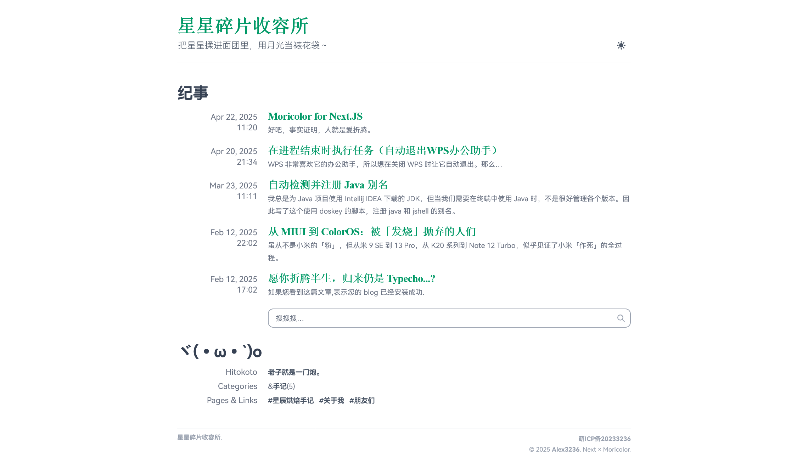

# Moricolor for Tailwind Nextjs Starter Blog

Inspired by [Moricolor for Typecho](https://github.com/txperl/Moricolor-for-Typecho).

Designed for one-author blogs with only one layout (PostSimple).

## Features

- [x] Moricolor theme
  - [x] Dark mode
  - [x] Mobile friendly
  - [x] Friends page
  - [ ] Tags page
- [x] Posts
  - [x] Category support
  - [x] Last modified time
  - [x] Standalone pages
  - [x] Weather record
- [x] Blog list homepage
  - [x] Hitokoto
  - [x] Custom links
  - [x] ICP display
- [x] MDX components
  - [x] Image preview
  - [x] Gallery
  - [x] Alert bar
  - [ ] ...
- [ ] Group component tree
- [ ] ...

## Lighthouse

  

## Licence

Licensed under GPL-3.0.
