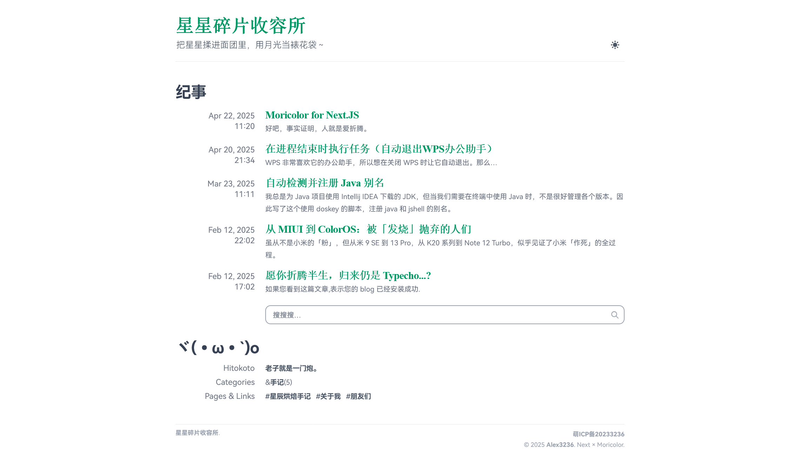

# 星星碎片收容所

[](https://space.alex3236.moe)

一个运行在 GitHub Pages 上的个人博客，目前由 [Astro](https://astro.build) 驱动，用 [Typst](https://typst.app) 写作。

主题风格承袭自 [Moricolor for Typecho](https://github.com/txperl/Moricolor-for-Typecho)，最早是用 Next.js 搭建的，后来因为 Contentlayer 不再维护、加上自己一直想试试 Typst 写东西的感觉，就在 2026 年中旬整体重构了一遍。

## 技术栈

- **框架**: Astro 5，静态输出到 GitHub Pages
- **内容**: Typst（`posts/*.typ`），通过 astro-typst 集成编译
- **样式**: Tailwind CSS v3，dark mode 适配
- **高亮**: highlight.js（代码块）和 medium-zoom（图片预览）
- **组件**: React 只用于需要客户端交互的几个小组件（主题切换、搜索、滚动按钮等）

## 目录结构

```
├── posts/          # 所有文章，支持 page/ 和 draft/ 子目录
├── templates/      # Typst 模板（blog.typ）
├── src/
│   ├── components/ # Astro 和 React 组件
│   ├── layouts/    # 页面布局
│   ├── pages/      # 路由页面
│   ├── data/       # 站点数据和查询逻辑
│   └── styles/     # 全局 CSS
├── public/         # 静态资源
└── astro.config.mjs
```

## 本地运行

```bash
npm install
npm run dev      # 开发模式，支持 .typ 文件热更新
npm run build    # 生产构建到 dist/
```

需要本地安装 Typst CLI（用于模板语法检查）。

## 写文章

在 `posts/` 下新建 `文章标题.typ`：

```typst
#import "/templates/blog.typ": *

#show: main-chinese.with(
  title: "文章标题",
  date: "2025-01-01",
  tags: ("标签一", "标签二"),
  category: "手记",
  summary: "一段简短的摘要。",
  weather: "晴",
)

== 第一节

正文内容写在这里。支持 = 到 ===== 五级标题、列表、代码块、表格和图片。

#figure(
  image("https://example.com/pic.png"),
  caption: [图片说明],
)
```

设为 `page: true` 可以创建单页（不在文章列表中出现，但有自己的 URL），设为 `draft: true` 则完全隐藏。

## License

GPL-3.0
